# ETSM Frontend

ETSM Frontend is a **_React_** + **_TypeScript_** application built with **_Vite_**.

- App using two popular CSS frameworks for UI custom and component reuse is **_TailwindCSS_** and **_Material_**.

- Also using supportive libraries like **_React Router_** for page routing, **_Tanstack Query_** and **_Axios_** for API calls, **_Frame Motion_** for UX, **_Socket.io Client_** for real-time chat.

## Project Structure

```
etsm_frontend/
  public/                Static assets served as-is
  src/
    assets/              Images and shared static assets
    components/          Reusable UI and feature components
      confirmation/      Confirmation flow components
      dashboard/         Dashboard layout and feature components
      login/             Login flow components
    constants/           Enums and app constants
    pages/               Route-level page components
    routes/              Route definitions and navigation
    services/            API clients and DTOs
      apis/              API wrappers (auth, task, user)
      dto/               TypeScript DTOs for API data
    styles/              Shared styling and theme assets
    App.tsx              App root component
    main.tsx             Entry point and app bootstrap
    index.css            Global styles
  index.html             HTML template
  vite.config.ts         Vite configuration
  tsconfig*.json         TypeScript configuration
  eslint.config.js       ESLint configuration
```

## Scripts

- `npm run dev` - Start the development server
- `npm run build` - Type-check and build for production
- `npm run preview` - Preview the production build locally
- `npm run lint` - Run ESLint
- `npm run format` - Format with Prettier

## Getting Started

1. Install dependencies:
   ```bash
   npm install
   ```
2. Start the dev server:
   ```bash
   npm run dev
   ```

Vite will print the local URL in the terminal (typically http://localhost:5173).

# Screenshots

## Role Selection

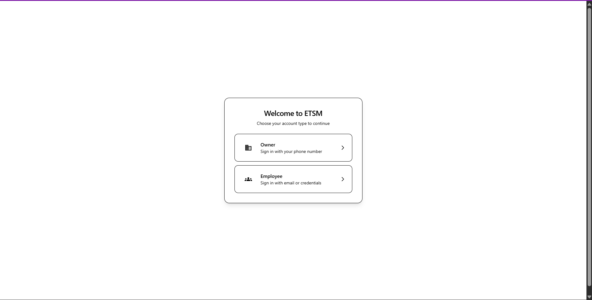

## Owner

### Phone number Form

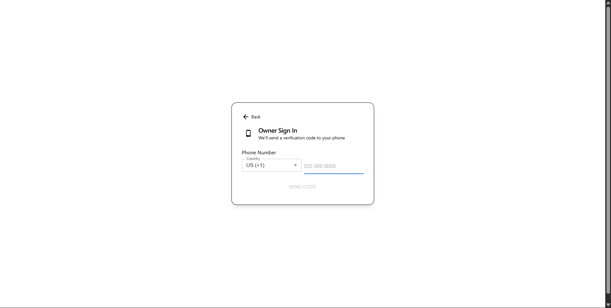

### OTP Validation Form

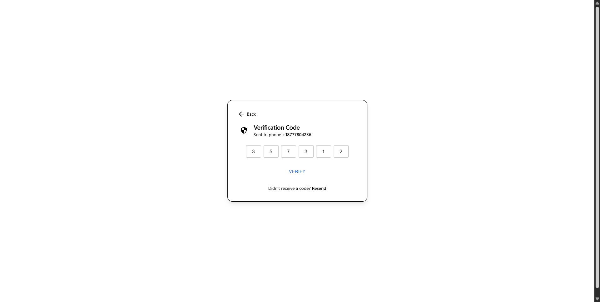

### Success Login Page

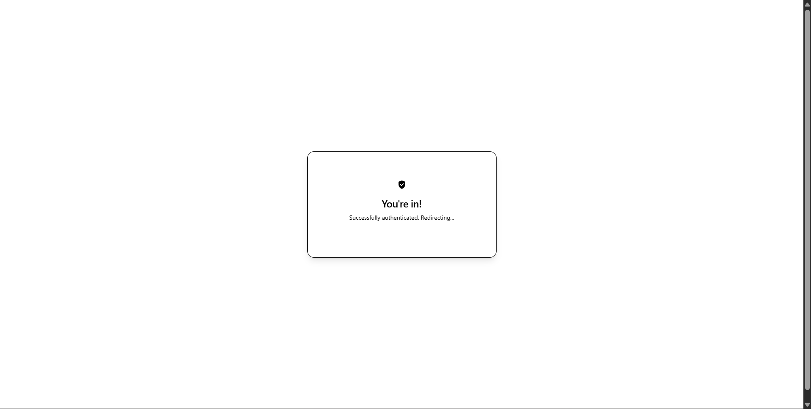

### Employee Management Tab

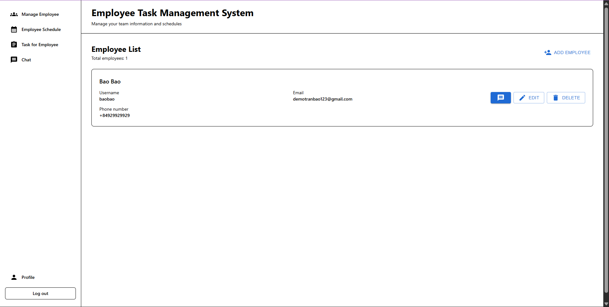

### Employee Work Schedule Management Tab

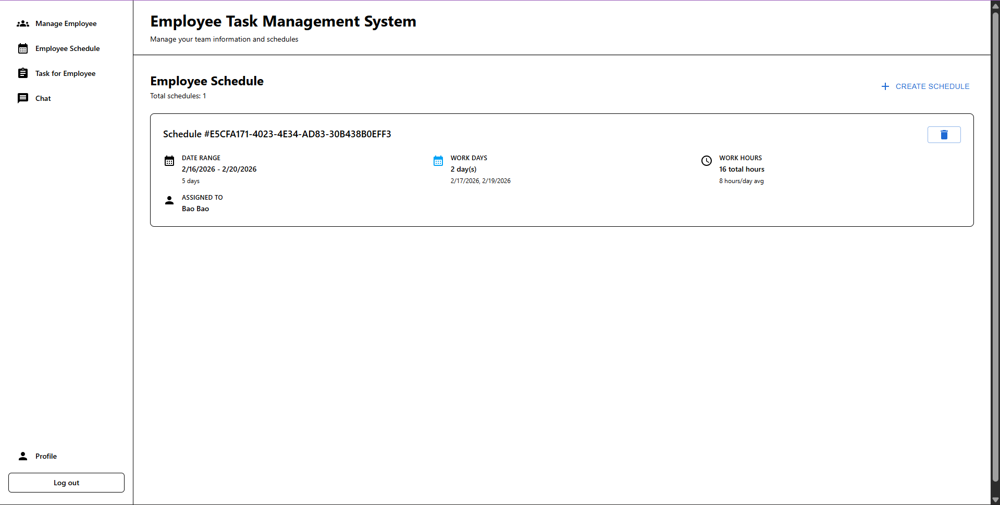

### Task Management Tab

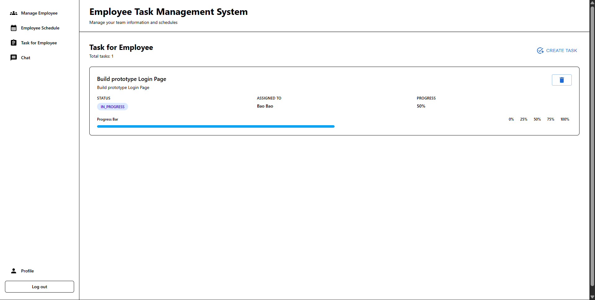

### Chat Tab

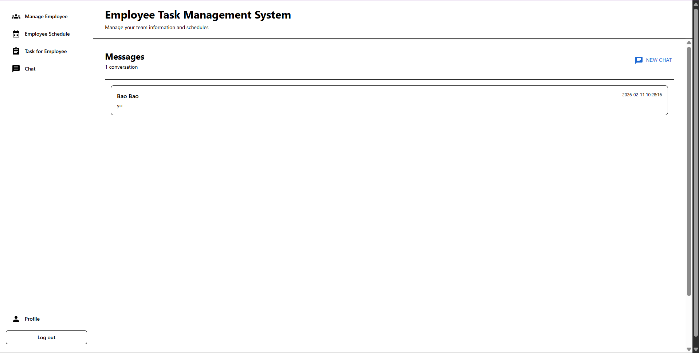

### Chat Box

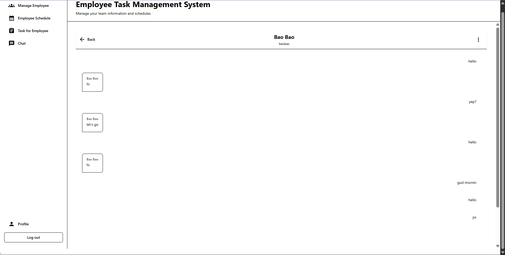

### User Profile Tab

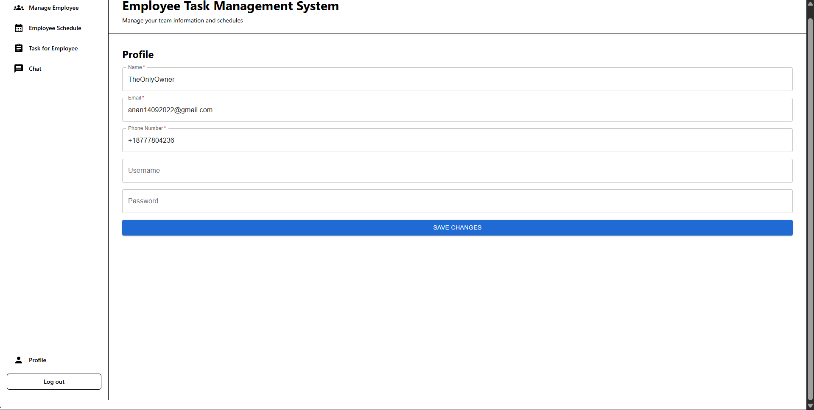

## Employee

### Login Method Selection Page

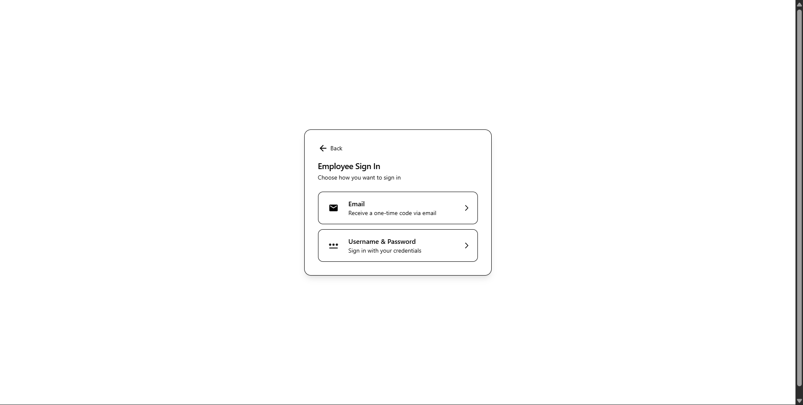

### Credential Login Page

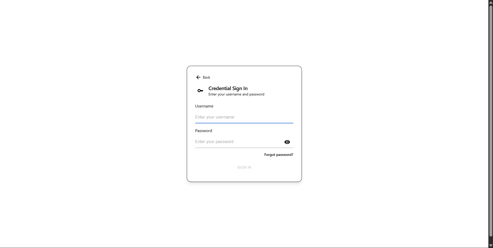

### Email Login Form

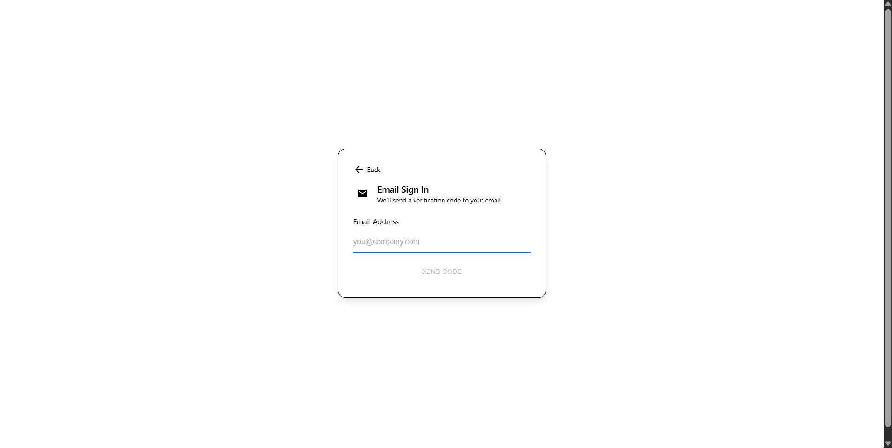

### Employee Dashboard Page

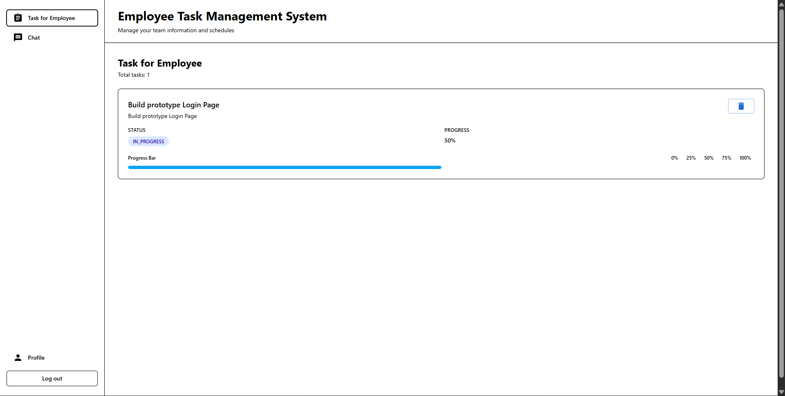
